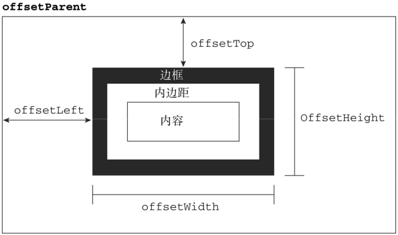
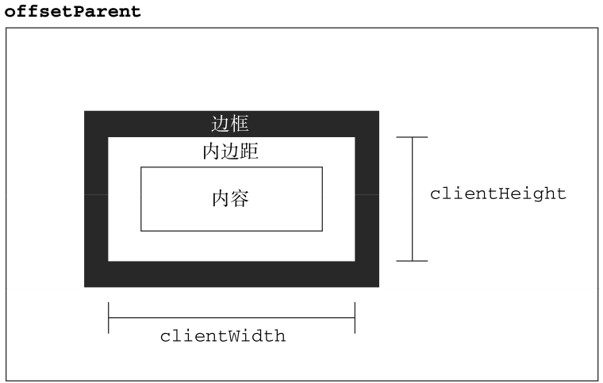
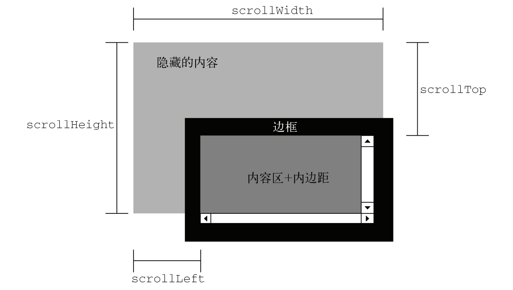

### what && why
瀑布流，又被称作为瀑布流式布局。视觉表现为参差不齐的多栏布局，随着页面滚动条向下滚动，这种布局还会不断加载数据块并附加至当前尾部。

视觉体验良好，更好的适应移动端

### 特点
- 内容框宽度固定，高度不固定
- 内容框从左到右排列，一行排满后，其余内容框就会按顺序排在短的一列后

### 实现原理
1. 计算一行能够容纳几列元素
2. 通过计算找出这些列中高度之和最小的一列，将下一行的第一个元素添加至其下面
3. 继续计算所有列中高度之和最小的一列，重复步骤2，直至所有元素添加完毕

### 细节说明
- 判断一行有多少列
  界面的宽度是变化的，所以列数也要跟着变化，原理大致如下
   1. 获取到页面的宽度
   2. 获取到每个盒子（图片）的宽度
   3. 需要显示的列数 = 页面宽度/盒子宽度（加上它的间隙）

### 属性回顾
> 包含元素的引用保存在offsetParent属性中。

偏移量

客户区大小

滚动大小
